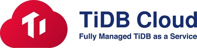

  
  
  

# 一键部署

 

# 背景&动机

Go 语言生态有有 Go Playground，这个工具可以执行简单的 Go 代码，并通过链接分享给他人。这使得使用者可以非常便捷地学习、验证基础的语言、库的能力，同时
还可以与他人分享，在 StackOverflow 上，Go 语言的提问和回答中的代码片段经常通过 Go Playround 来承载和分享。但 Python 官方却没有这么一个工具，所以
我们想基于 WASM、Serverless 和 TiDB Cloud，来实现一个类似于 Go Playground 的 Python Playground。

# 项目设计

## Kernel

Kernel 侧，我们使用 Pyodide 将 Python 解释器直接运行在用户的浏览器中，这样所有 Python 代码的执行将在用户的浏览器中完成。

## 接入层

因为我们的语言执行都在浏览器中完成，我们的后端将变得异常轻薄，仅仅需要接收代码片段然后将其存储到数据库中，本身没有任何的状态，所以我们可以使用
Serverless Function，将我们的接入层托管到 Serverless 平台上（如 Vercel/Netlify)。

## Storage

因为我们需要通过链接分享给他人，打开这个链接后，我们要能恢复对应的代码片段，所以我们需要有一个持久存储来存储代码片段。这里我们选择 TiDB Cloud。TiDB
Cloud 即将推出 Serverless Cluster，这样也能更好地与我们的接入层配合。
